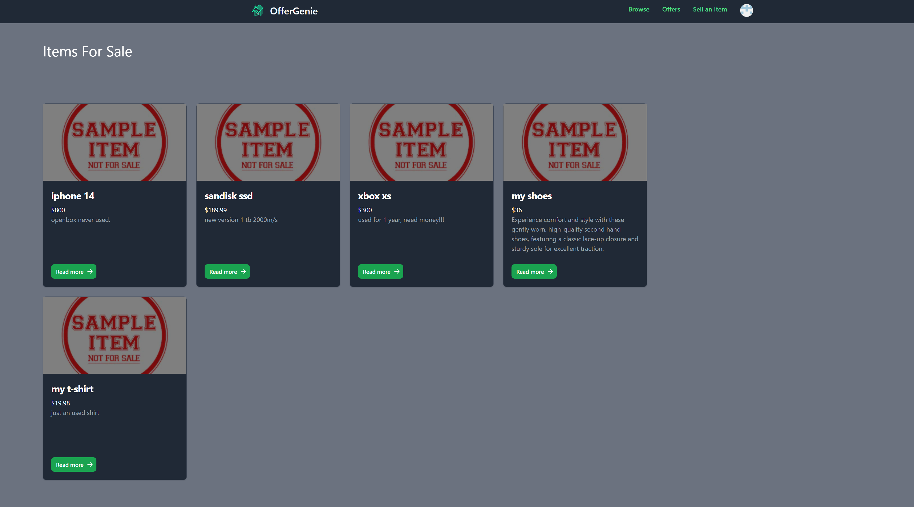
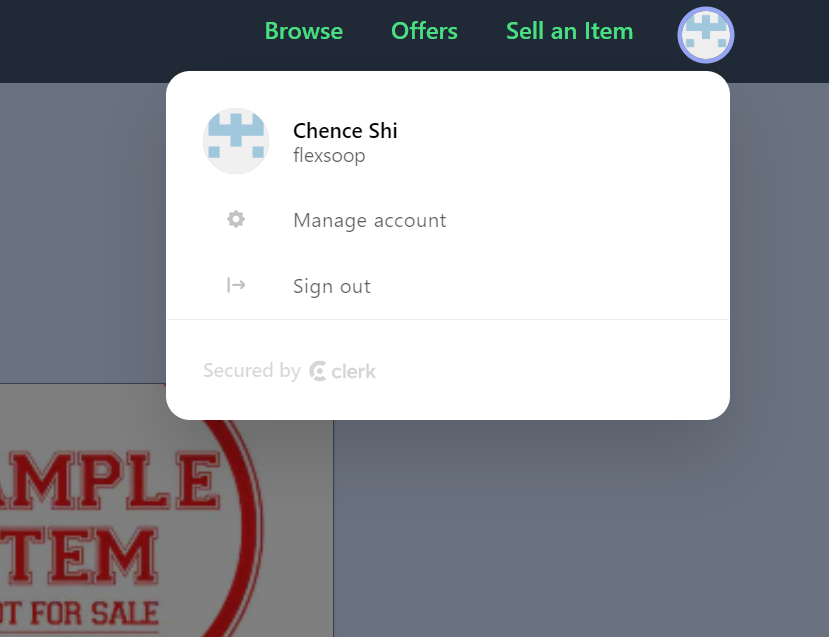

# Offer-genie

Offer-genie is an online marketplace project provides a platform for users to browse items, make sell item posts, message sellers, and make offers. 

## Tech Stack
React
Tailwind CSS
Next.js
TypeScript
tRPC route
PostgreSQL
Prisma

## Features
Authentication: Offer-genie uses Clerk for authentication, providing a secure login and registration system.
Browse Items: Users can browse through a wide range of items available on the marketplace.
Sell Item Post: Sellers can create posts to sell their items, including details and images.
Message Seller: Users can send messages to sellers for inquiries or negotiations.
Make Offer: Buyers can make offers on items they are interested in.

## Screenshot

## Deployment
Offer-genie is deployed using the following services:

PostgreSQL: Railway is used to host the PostgreSQL database.
Vercel: The application is hosted on Vercel for a seamless and scalable deployment experience.
## Getting Started
To run Offer-genie locally, follow these steps:

Clone the repository: git clone https://github.com/your-username/offer-genie.git
- Install dependencies: `npm install`
- Set up the environment variables. Rename `.env.example` to `.env` and provide the necessary variables.
- Set up the PostgreSQL database using Prisma. Refer to the Prisma documentation for detailed instructions.
- Start the development server: `npm run dev`
- Access Offer-genie in your browser at `http://localhost:3000`

##License
Offer-genie is licensed under the MIT License.
